# NotiApi

Notifications Api Developed in Net Core

# Crear una nueva solución

> Puede agregar un nombre a la solución, en caso de no colocar uno, se tomará el nombre de la carpeta donde se cree.

```
dotnet new sln
```

# Crear un nuevo proyecto Web Api

> Recuerde que puede colocar cualquier nombre al proyecto, es buena practica dejar en el nombre la palabra Api, en este caso lo dejaremos solo con le nombre Api.

```
dotnet new webapi -o Api
```

# Crear una nueva Class Lib llamada Core

> Más adelante en este proyecto se agregarán las **_Entidades_** y las **_Interfaces_**.

```
dotnet new classlib -o Core
```

# Crear una nueva Class Lib llamada Infrastructure

> Más adelante en este proyecto se agregarán las **_Configuraciones para las Interfaces_**, las **_Migraciones_**, La **_UnitOfWork_** y los **_Repositories_**.

```
dotnet new classlib -o Core
```

# Agregar los proyectos creados a la solución

> Cuando vaya a agregar la ruta de la carpeta del proyecto, basta con colocar la letra con la que inicia el nombre y oprima la **tecla** **_Tab_**, se autocompletara la ruta.

- ## Para el proyecto web Api

  - ```
    dotnet sln add -o .\Api\
    ```

- ## Para el proyecto Core

  - ```
    dotnet sln add -o .\Core\
    ```

- ## Para el proyecto Infrastructure
  - ```
    dotnet sln add -o .\Infrastructure\
    ```

# Verificar si se agregaron los proyectos a la solución

```
dotnet sln list
```

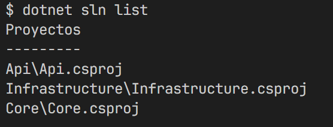

# Agregar Referencias entre los proyectos

> Es necesario ubicarse en la carpeta de donde se va a crear la referecnia, ejemplo si es desde **Api**, ubicarse en la carpeta Api: **_cd Api_**.

- ## Referencia entre el proyecto webApi y Infrastructure

  - ```
    dotnet add reference ..\Infrastructure\
    ```

- ## Referencia entre el proyecto Infrastructure y Core

  - ```
    dotnet add reference ..\Core\
    ```

# Instalar las dependecias o paquetes necesarios para realizar el proyecto

> la Instalación la realizaremos desde la Extencion **_Nuget Gallery_**.

- ## Para Api:
  - #### AspNetCoreRateLimit
    - 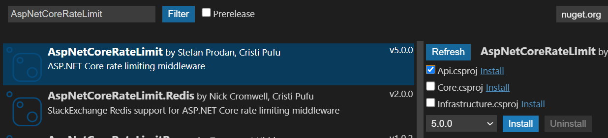
  - #### AutoMapper
    - 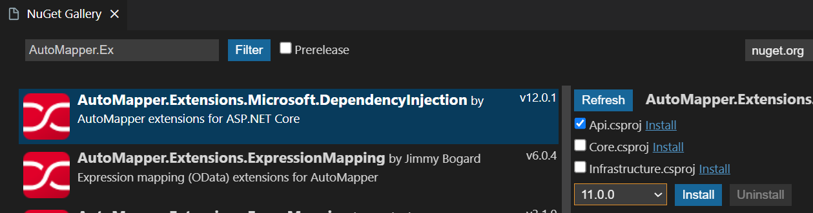
  - #### Microsoft.EntityFrameworkCore.Design
    - 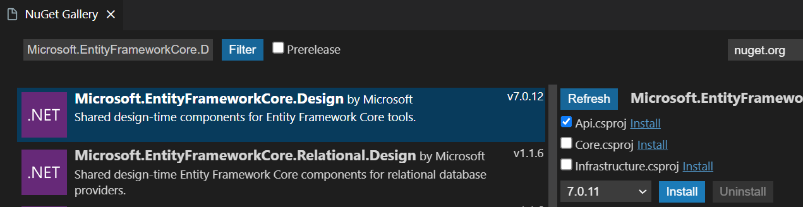
- ## Para Infrastructure:
  - #### Microsoft.EntityFrameworkCore
    - 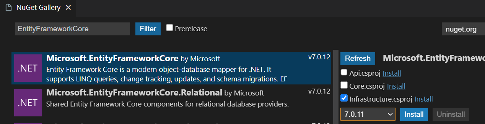
  - #### Pomelo.EntityFrameworkCore.MySql
    - 

# Crear La carpeta Entities y la clase BaseEntity

> Ubicarse en la carpeta **_Core_** del proyecto, crear una carpeta llamada **_Entities_**, dentro de esta carpeta crear la clase **_BaseEntity_**.

- ### Puede crear una nueva clase de la siguiente manera:
  - 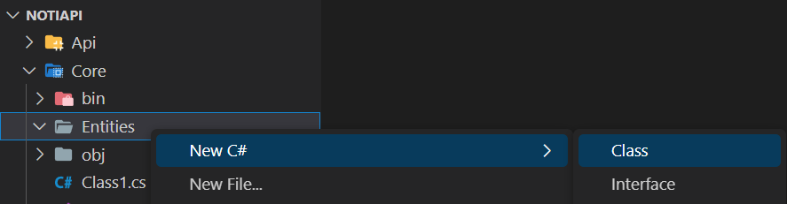

> En BaseEntity agregamos los datos(columnas o Atribbutos) que se repitn en todas las tablas de la DB, para este caso serian **_Id, CreationDate, ModificationDate_**.

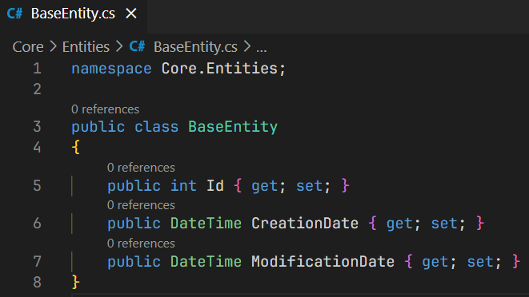

> Para todas las **_Entidades_** que se creen a partir de este punto, debemos hacer **_Herencia_** de la clase **_BaseEntity_**.

# Crear Entities para cada una de las tablas de la DB

> Ubicarse en la carpeta **_Core_** del proyecto, crear la carpeta **_Entities_**, dentro de esta carpeta se van a dividir crear 3 **_Subcarpetas (Block, Notifications, Person)_**, esto para crear una división entre las entidades y así poder acceder o realizar busquedas de manera rapida.

- ## En las 3 subcarpetas se deben agregar las siguientes entitades:

  - 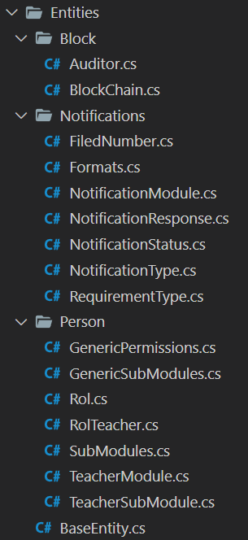

- ## Ejemplo de como seria una entitdad con realación de 1 a muchos, donde esta seria el 1:

  - 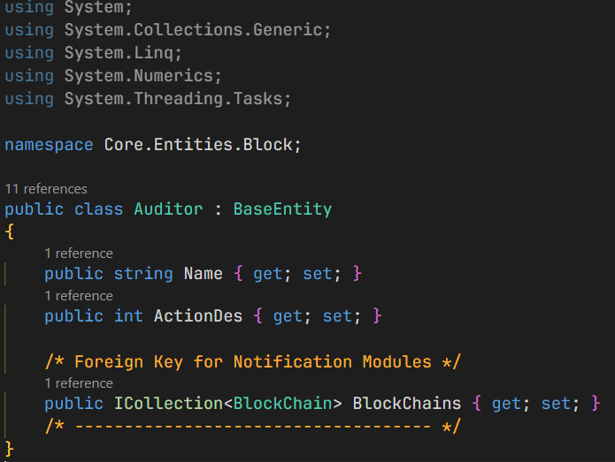

- ## Ejemplo de como seria una entitdad con realación de 1 a muchos, donde esta seria el muchos:
  - 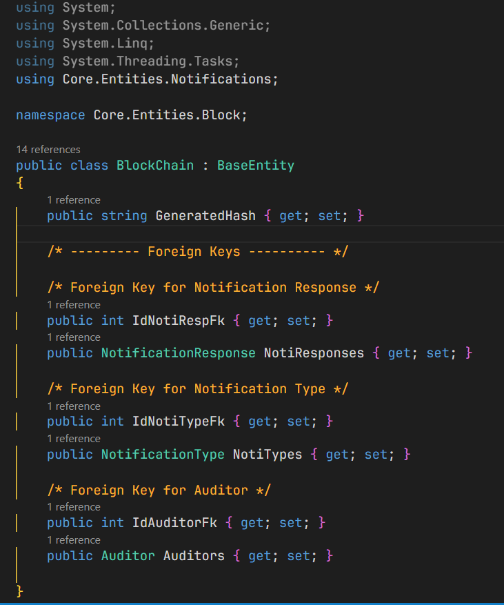

# Crear Dtos para cada una de las Entidades Creadas

> El proposito de crear los **_Dtos_** es restringir que infromación se enviará como respuesta cuando se realice una petición a nuestra App.

- ## En la Carpeta Api crear una carpeta llamada Dtos, así mismo crear 2 subcarpetas con el nombre Get y Post, despues agregar las 3 subcarpetas para mantener el orden ya establecido.

  - 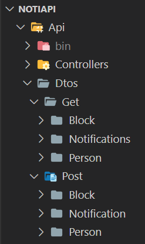

  > El Proposito de crear estas 2 subcarpetas es para separar los **_Dtos_** que se utilizarán en las peticiones **_Get_** y cuales en las peticiones **_Post_**.

- ## Ejemplo Dto Get

  - 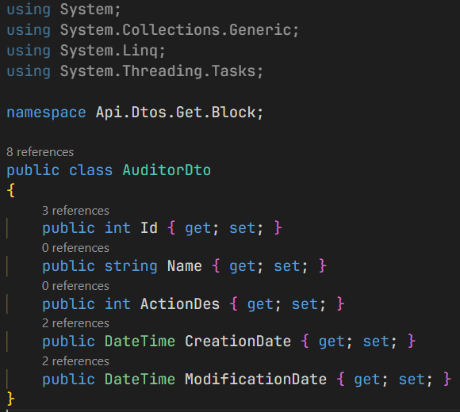
    > En los **_Dtos Get_** evitamos colocar las columnas o campos que son de **_llaves foraneas_** o **_Icollection_** de referecnias a otras **_Entidades_**.

- ## Ejemplo Dto Post

  - 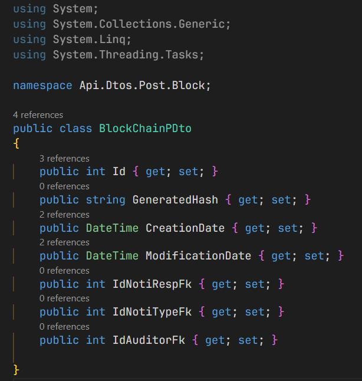
    > En los **_Dtos Post_** por lo general dejamos casi todos los campos, esto para evitar errores en las peticiones **_PUT_** O **_Post_**.

- ## En Api crear una carpeta llamada Profile, despues crear una nueva clase llamada MappingProfiles

  - 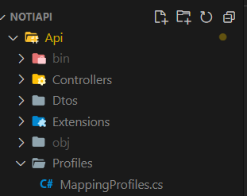
    > En esta clase debemos agregar el respectivo **_mapeo_** para cada entidad.

  - 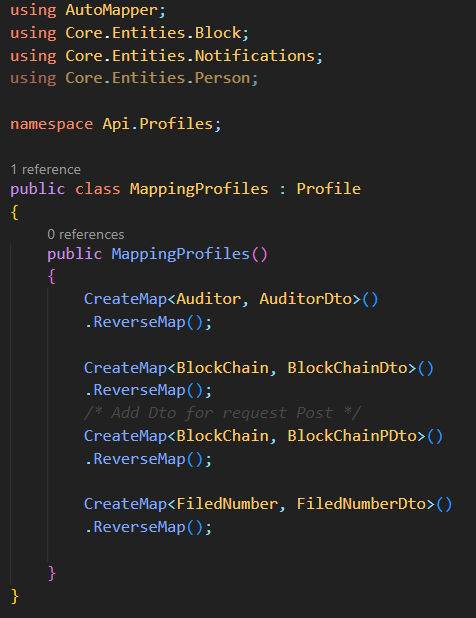
    > Ejemplo de como crear los **_Mapeos_** para las **_Entidades_**, tanto para el **_Dto Get_** como el **_Post_**.

# En Infrastructure Crear la carpeta Data y una subcarpeta llamada Configuration, adicionalmente crear la clase Context.

> Por buenas practicas al archivo **_Context_** se le puede dar el nombre de la **_Api_** seguido de la palabra **_Context_** **_(NotiApiContext)_**.

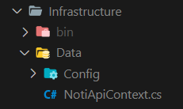

  - ## Crear los DbSet para cada una de las Entidades creadas.
    > la clase principal del archivo **_Context_** debe **_heredar_** de la clase **_DbContext_**, la cual viene con el paquete de **_EntityFrameworkCore_** que se instaló previamente.

    > Ejemplo de como se deben crear los DbSet para cada **_Entidad_**.

    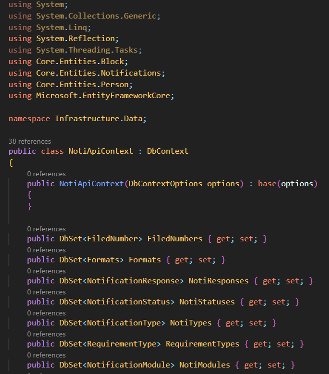

   - ## Agregar el metodo OnModelCreating en el archico Context.
     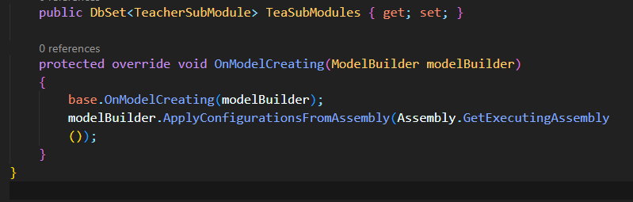

